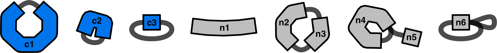
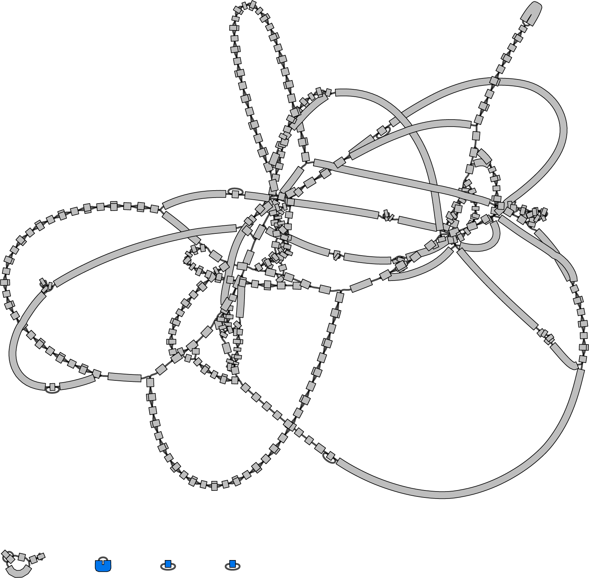
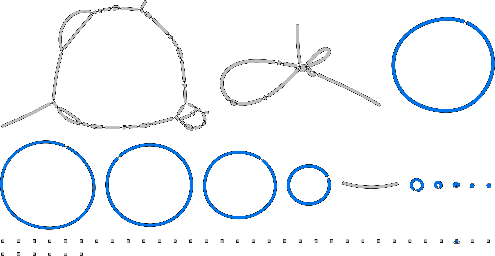

# Circular Contig Extractor

This repo contains a Python script ([`circular_contig_extractor.py`](circular_contig_extractor.py)) which takes a GFA assembly graph as input and extracts complete circular contigs. Circular contigs can be filtered by size and/or by [Mash-distance](https://mash.readthedocs.io/en/latest/tutorials.html#simple-distance-estimation) to a query sequence.


## Table of contents

* [Example assembly graphs](#example-assembly-graphs)
* [Important note](#important-note)
* [Requirements](#requirements)
* [Installation](#installation)
* [Method](#method)
* [Quick usage](#quick-usage)
* [Full usage](#full-usage)
* [License](#license)


## Example assembly graphs

### Toy example

This toy assembly graph has nine contigs, three of which `circular_contig_extractor.py` would consider circular (prefixed with **c**) by and six of which it would not (prefixed with **n**).

<p align="center"><picture><source srcset="images/toy_example-dark.png" media="(prefers-color-scheme: dark)"></picture></p>

<details>
<summary>GFA input</summary>
<figure>
<pre>
<code>S	c1	AATATGAAAGGGTGTTGGGTATTCGCGGGTACACG
S	c2	TCATTTCTTTCA
S	c3	TGTGA
S	n1	TCTTGCAACTTCATGAGGT
S	n2	ACATTTTCTTCATGGG
S	n3	GAAAGAGGCG
S	n4	ACGTGCTTGGGACCTAGCCAATGAT
S	n5	TACCA
S	n6	CTGTC
L	c1	+	c1	+	0M
L	c2	-	c2	-	3M
L	c3	+	c3	+	0M
L	c3	-	c3	-	0M
L	n2	+	n3	+	0M
L	n3	+	n2	+	0M
L	n4	+	n4	+	0M
L	n4	+	n5	+	0M
L	n6	+	n6	+	0M
L	n6	+	n6	-	0M</code>
</pre>
</figure>
</details>


<details>
<summary>FASTA output</summary>
<figure>
<pre>
<code>>c1
AATATGAAAGGGTGTTGGGTATTCGCGGGTACACG
>c2
TCATTTCTT
>c3
TGTGA</code>
</pre>
</figure>
</details>

As you can see in the GFA, circularising links can be on the positive strand (c1), negative strand (c2) or both (c3). Any other links will render a contig non-circular. If a circularising link has overlap (c2), then that overlap will be trimmed off in the output.


### Short-read example

Given this short-read bacterial genome assembly graph as input, `circular_contig_extractor.py` will extract the three contigs (all small plasmids) highlighted in blue:
<p align="center"><picture><source srcset="images/short-read_example-dark.png" media="(prefers-color-scheme: dark)"></picture></p>

In short-read bacterial genome assembly graphs, most (but not all) small plasmids will assemble to circular contigs. Conversely, most (but not all) large plasmids will fail to assemble to circular contigs. This example has a large plasmid at the bottom-left made of six non-circular contigs.


### Long-read example

Given this long-read plate-sweep assembly graph as input, `circular_contig_extractor.py` will extract the 11 contigs (some chromosomes, some plasmids) highlighted in blue:
<p align="center"><picture><source srcset="images/long-read_example-dark.png" media="(prefers-color-scheme: dark)"></picture></p>


## Important note

When using `circular_contig_extractor.py` to look for chromosomes or plasmids, false-negative results are common! Sometimes replicons do not cleanly assemble into separate circular contigs, and this script will ignore anything that is not separate and circular. For example, if you are using it to extract small plasmids and get no result, this does not necessarily mean that the input genome has no small plasmids.


## Requirements

You'll need [Python](https://www.python.org/) 3.8 or later to run `circular_contig_extractor.py`. It's a standalone script and has no Python package dependencies (i.e. it only uses the standard library).

There is one external dependency, [Mash](https://github.com/marbl/Mash), which you'll need installed and callable on your command line. If you can run `mash dist -h` without getting an error, you should be good to go! Note that if you aren't using the `--query` option (see method below), then the Mash requirement does not apply.


## Installation

Since `circular_contig_extractor.py` is a single script, no installation is required. You can simply clone it and run it:
```bash
git clone https://github.com/rrwick/Circular-Contig-Extractor
Circular-Contig-Extractor/circular_contig_extractor.py --help
```

If you plan on using it often, you can copy it to someplace in your PATH variable for easier access:
```bash
git clone https://github.com/rrwick/Circular-Contig-Extractor
cp Circular-Contig-Extractor/circular_contig_extractor.py ~/.local/bin
circular_contig_extractor.py --help
```

If you'd like to double-check that everything works as intended, you can run this repo's [automated tests](test).


## Method

`circular_contig_extractor.py` loads a GFA and does the following steps:
* Filter for circular contigs.
  * To count as circular, there needs to be a same-strand link connecting the contig to itself and no other links.
  * When visualised in [Bandage](https://github.com/rrwick/Bandage), circular contigs are separate from the rest of the graph (are their own [connected component](https://en.wikipedia.org/wiki/Component_(graph_theory))) and form a simple loop.
* Trim off any overlap. If the circularising link has a non-zero gapless [CIGAR string](https://drive5.com/usearch/manual/cigar.html) (e.g. `55M`), then the overlapping bases are removed from the end of the contig to produce an overlap-free sequence. This is particularly relevant for SPAdes assemblies which contain overlaps.
* If `--min` and/or `--max` were used, filter on contig sizes.
* If `--query` was used, filter on Mash distances.
  * Each sequence in the query FASTA file is considered a separate query, and contigs will pass the filter if they are sufficiently close to any of the queries.
  * For example, you could put two different plasmid sequences in a file called `plasmids.fasta`, call the script with `--query plasmids.fasta`, and any circular contig which matches either of the plasmid sequences will be included in the output.


## Quick usage

`circular_contig_extractor.py` take a [GFA file](https://gfa-spec.github.io/GFA-spec/GFA1.html) as input, such as those made by [SPAdes](https://github.com/ablab/spades) or [Unicycler](https://github.com/rrwick/Unicycler). It outputs to stdout in FASTA format.

Get all circular contigs from an assembly graph:
```
circular_contig_extractor.py assembly.gfa > circular_contigs.fasta
```

Get complete chromosomes 1 Mbp in size or larger:
```
circular_contig_extractor.py --min 1000000 assembly.gfa > small_plasmids.fasta
```

Get complete small plasmids ranging from 1–10 kbp in size:
```
circular_contig_extractor.py --min 1000 --max 10000 assembly.gfa > small_plasmids.fasta
```

Get circular contigs that closely match a query sequence:
```
circular_contig_extractor.py --query query.fasta --mash 0.01 assembly.gfa > close_matches.fasta
```

Get circular contigs that distantly match a query sequence:
```
circular_contig_extractor.py --query query.fasta --mash 0.2 assembly.gfa > distant_matches.fasta
```


## Full usage

```
usage: circular_contig_extractor.py [--min MIN] [--max MAX] [--query QUERY] [--mash MASH]
                                    [-h] [--version]
                                    input_gfa

Circular Contig Extractor

Positional arguments:
  input_gfa      Input assembly graph in GFA format

Contig size settings:
  --min MIN      Minimum contig size in bp (default: no minimum size)
  --max MAX      Maximum contig size in bp (default: no maximum size)

Query settings:
  --query QUERY  Query reference sequence(s) in FASTA format (default: none)
  --mash MASH    Maximum Mash distance to query sequence

Other:
  -h, --help     Show this help message and exit
  --version      Show program's version number and exit
```


## License

[GNU General Public License, version 3](https://www.gnu.org/licenses/gpl-3.0.html)
